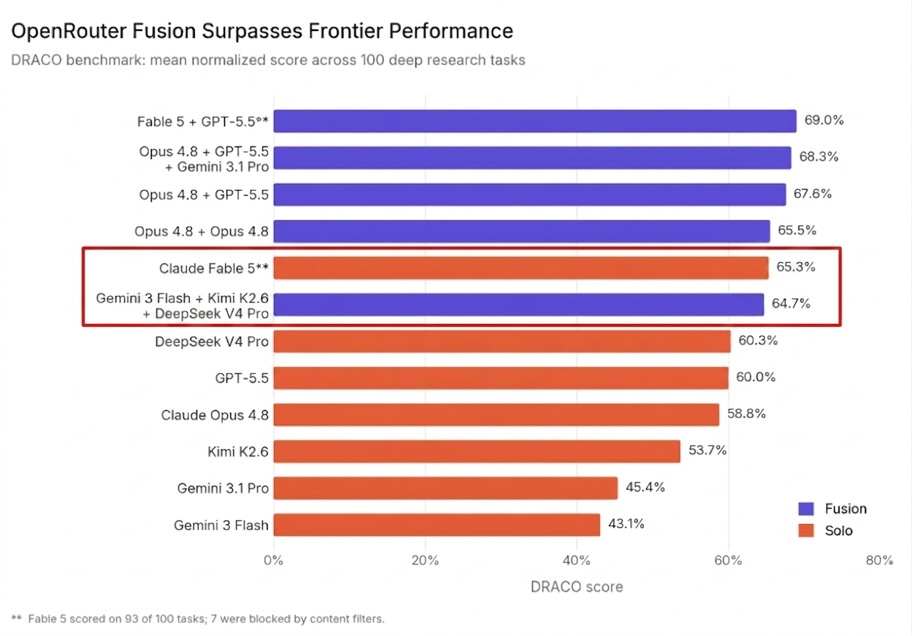

# Universal Fusion Plugin

Multi-model fusion which achieves Claude Fable 5 level performance for Antigravity, Claude Code, and Codex CLI. Fan out your prompt to a panel of models, synthesize the best answer, get per-model telemetry, and receive a compiled `synthesis.md` file . Inspired by [OpenRouter's Fusion](https://openrouter.ai/docs/guides/features/plugins/fusion).
> *"The more tokens you throw at SOTA models, the better the answer.*
> *Cast your prompt into a solitary mind, and you receive a mere response.*
> *But weave a million tokens across a chorus of State-of-the-Art intellects, and you uncover the truth."*



[📸 View an Example Run in the CLI](IMG_20260615_185839.jpg)

## 🌟 Features
- **Skill-based invocation**: Just type `/fusion` followed by your prompt. Works universally across CLIs.
- **Cross-CLI Support**: Seamlessly works inside Antigravity, Claude Code, and Codex CLI.
- **Interactive First-Run Setup**: The agent will automatically ask you to define your custom model panel on your first run.
- **Bring Your Own Judge**: The "Judge Model" is simply the model you currently have active in your CLI. Want Claude to judge Gemini and GPT? Just set Claude as your active model before running `/fusion`!
- **Multi-agent fan-out**: Spawns parallel subagents across the models you select.
- **Markdown Synthesis**: Saves the final God-tier synthesis directly to `synthesis.md` in your current directory, keeping your chat clean.
- **Per-model telemetry**: Every run ends with a ✅/❌ health table showing exactly what happened in the chat.

## 📊 Why Fusion Works

OpenRouter's DRACO benchmark proved that panels of models consistently outperform individual models — even budget panels beat frontier models.

## 🚀 Installation

Because Fusion is purely prompt-and-skill-driven, you can install it into any modern agentic CLI.

### For Antigravity CLI
```bash
git clone https://github.com/ProxyAyush/antigravity-fusion-plugin.git
agy plugin install ./antigravity-fusion-plugin
```

### For Claude Code
Claude Code automatically scans `SKILL.md` files in your `.claude/skills` directory.
```bash
mkdir -p ~/.claude/skills/fusion
curl -o ~/.claude/skills/fusion/SKILL.md https://raw.githubusercontent.com/ProxyAyush/antigravity-fusion-plugin/master/skills/fusion/SKILL.md
```

### For Codex CLI
Codex CLI automatically scans `SKILL.md` files in your `.codex/skills` directory.
```bash
mkdir -p ~/.codex/skills/fusion
curl -o ~/.codex/skills/fusion/SKILL.md https://raw.githubusercontent.com/ProxyAyush/antigravity-fusion-plugin/master/skills/fusion/SKILL.md
```

## 📖 Usage

### First Run
Type `/fusion hello` in your chat. The agent will detect that you haven't set up your panel yet and will ask you:
> *"Welcome to Fusion! What models do you want to include in your panel? Please give me a list of models available in your CLI."*

Reply with your models (e.g., "Claude 3.5 Sonnet, GPT-4o, Gemini 1.5 Pro"). The agent will save these preferences globally.

### Running Fusion
Simply type `/fusion` followed by your prompt:
```
/fusion What's the best architecture for a Solarpunk game engine?
```

The agent will:
1. Print a spinning banner showing your panel spinning up.
2. Spawn parallel subagents for each model.
3. Judge & synthesize their responses.
4. Output a **per-model telemetry table** in the chat.
5. Save the final deep analysis to `synthesis.md` in your current folder.

## 📚 References
- [OpenRouter Fusion API Docs](https://openrouter.ai/docs/guides/features/plugins/fusion)
- [Fusion Beats Frontier Benchmark](https://openrouter.ai/blog/announcements/fusion-beats-frontier/)

## ❓ FAQ

<details>
<summary>▶️ Who is the judge model and how can I change it?</summary>
<br>
The Judge Model is simply the model you currently have active in your CLI window when you run the `/fusion` command. To change the judge model, just switch your active model in the CLI before invoking fusion. For example, if you want Claude to judge Gemini and GPT, just select Claude as your active CLI model!
</details>

<details>
<summary>▶️ How can I easily change the models inside the fusion panel?</summary>
<br>
On your first run, the agent will ask you to set up your panel. If you want to change them later, you can simply edit the `~/.fusion_panel_prefs.txt` file and update the list of models (one per line). Alternatively, just delete that file and the agent will prompt you to set them up again on your next run.
</details>

<details>
<summary>▶️ Can this be used in other CLIs like Claude Code and Codex?</summary>
<br>
Yes! Because Fusion is purely a prompt-and-skill-driven workflow, it works universally. See the Installation section above for instructions on how to drop the `SKILL.md` file into your CLI of choice.
</details>

<details>
<summary>▶️ Where does the final synthesized answer go?</summary>
<br>
To keep your chat clean, the full synthesis is not printed in the terminal. Instead, the agent saves it to a `synthesis.md` file in your current working directory. In the chat, you will see the spinning banner, the final telemetry table, a brief 2-3 sentence summary of the findings, and a prompt asking if you'd like to read the file or implement the results directly.
</details>
